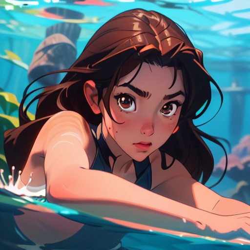
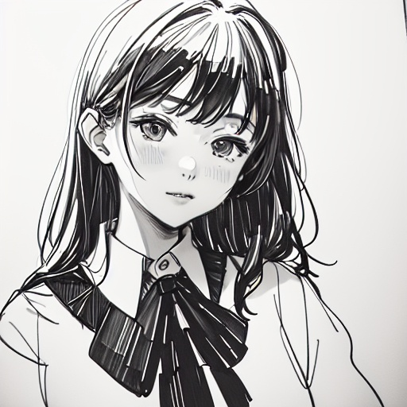
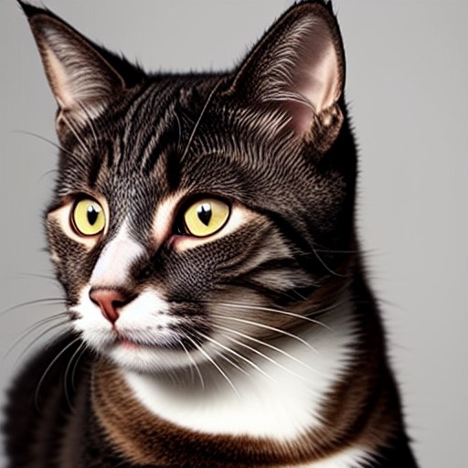
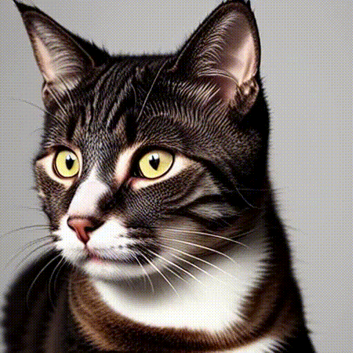
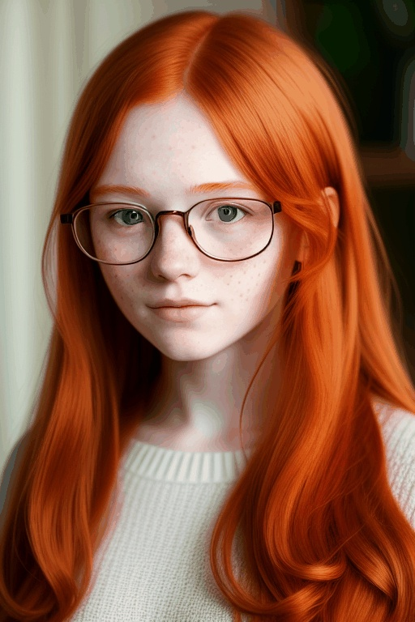

<div align="center">
<!-- <h1>AnimateZero</h1> -->
<h3>AnimateZero: Video Diffusion Models are Zero-Shot Image Animators</h3>

[Jiwen Yu](https://vvictoryuki.github.io/website/)<sup>1</sup>, [Xiaodong Cun](https://vinthony.github.io/academic/)<sup>2</sup>, [Chenyang Qi](https://chenyangqiqi.github.io/)<sup>3</sup>, [Yong Zhang](https://yzhang2016.github.io/)<sup>2</sup>, [Xintao Wang](https://xinntao.github.io/)<sup>2</sup>, [Ying Shan](https://scholar.google.com/citations?hl=zh-CN&user=4oXBp9UAAAAJ)<sup>2</sup>, [Jian Zhang](https://jianzhang.tech/)<sup>1</sup>

<sup>1</sup> Peking University, <sup>2</sup> Tencent AI Lab, <sup>3</sup> HKUST

[](https://arxiv.org/abs/2312.03793)
[](https://github.com/vvictoryuki/AnimateZero/blob/main/AnimateZero.pdf)
[](https://vvictoryuki.github.io/animatezero.github.io/)

</div>

## Gallery

We have showcased some results of image animation using AnimateZero on generated images below. 

More results can be found on our [Project Page](https://vvictoryuki.github.io/animatezero.github.io/).

<table>
  <tr>
    <td></td>
    <td></td>
    <td></td>
    <td></td>
    <td></td>
    <td></td>
  </tr>
  <tr>
    <td colspan="2"><center>"1girl, underwater, swimsuit, ..."</center></td>
    <td colspan="2"><center>"1girl, black jacket, long sleeves, ..."</center></td>
    <td colspan="2"><center>"dark fantasy, purple eyes, ..."</center></td>
  </tr>
  <tr>
    <td></td>
    <td></td>
    <td></td>
    <td></td>
    <td></td>
    <td></td>
  </tr>
  <tr>
    <td colspan="2"><center>"school uniform, JK, sketch, ..."</center></td>
    <td colspan="2"><center>"pixel art, cat ears, blonde hair, ..."</center></td>
    <td colspan="2"><center>"a cat head, look to one side"</center></td>
  </tr>
  <tr>
    <td></td>
    <td></td>
    <td></td>
    <td></td>
    <td></td>
    <td></td>
  </tr>
  <tr>
    <td colspan="2"><center>"waves hit the beach"</center></td>
    <td colspan="2"><center>"freckles, orange hair, glasses, ..."</center></td>
    <td colspan="2"><center>"lighter, flame, candle"</center></td>
  </tr>
</table>

## BibTeX
```
@article{yu2023animatezero,
  title={AnimateZero: Video Diffusion Models are Zero-Shot Image Animators},
  author={Yu, Jiwen and Cun, Xiaodong and Qi, Chenyang and Zhang, Yong and Wang, Xintao and Shan, Ying and Zhang, Jian},
  journal={arXiv preprint arXiv:2312.03793},
  year={2023}
}
```
